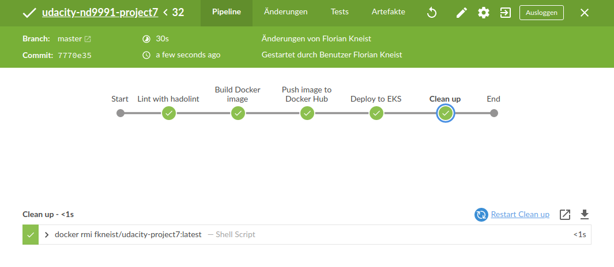

# Udacity Cloud DevOps Engineer - Project 7

## Live Demo

http://a87a17068ab9f477ca8245f8b8ba0ab3-736430264.us-west-2.elb.amazonaws.com/ (will be deleted after project is rated)

## Design Decisions
* Rolling deployment or blue/green deployment: rolling deployment
* AWS Kubernetes as a Service, or build your own Kubernetes cluster: AWS Kubernetes as a Service
* What to deploy: simple nginx hosted site with custom HTML

## Deploy Instructions

### Network:

```bash
# Create
scripts/create-stack.sh \
  project7-network-stack \
  infrastructure/network/network.yml \
  infrastructure/network/network.json \
  fkneist-private

# Delete 
scripts/delete-stack.sh \
  project7-network-stack \
  fkneist-private
```

### IAM (Jenkins)

```bash
# Create
scripts/create-stack.sh \
  project7-iam-stack \
  infrastructure/jenkins/iam.yml \
  infrastructure/jenkins/iam.json \
  fkneist-private

# Delete
scripts/delete-stack.sh \
  project7-iam-stack \
  fkneist-private
```

### Jenkins Server

```bash
# Create
scripts/create-stack.sh \
  project7-jenkins-stack \
  infrastructure/jenkins/server.yml \
  infrastructure/jenkins/server.json \
  fkneist-private

# Delete
scripts/delete-stack.sh \
  project7-jenkins-stack \
  fkneist-private
```

### EKS cluster

```bash
# Create
scripts/create-stack.sh \
  eks-stack \
  infrastructure/eks/eks.yml \
  infrastructure/eks/eks.json \
  fkneist-private

# Delete
scripts/delete-stack.sh \
  eks-stack \
  fkneist-private
```

### EKS Nodes

```bash
# Create
scripts/create-stack.sh \
  eks-nodes-stack \
  infrastructure/eks/eks-nodes.yml \
  infrastructure/eks/eks-nodes.json \
  fkneist-private

# Delete
scripts/delete-stack.sh \
  eks-nodes-stack \
  fkneist-private
```

### Setup Jenkins
* Get `<EC2_instance_public_ip>` from AWS Console
* SSH into EC2 instance: `ssh -i <pem_file> ubuntu@<EC2_instance_public_ip>`
* Get password: `sudo cat /var/lib/jenkins/secrets/initialAdminPassword`
* Visit `<EC2_instance_public_ip>:8080` in browser, set up user with above password
* Install recommended plugins
* Install plugins: `Blue Ocean Aggregator`, `Pipeline: AWS Steps`
* Visit `<EC2_instance_public_ip>:8080/blue` in browser
* Create new project, `Where do you store your code?`, select GitHub, enter token, select profile, select project `udacity-nd9991-project7`, press `Create Pipeline`
* Add Docker Hub credentials to Jenkins
* Add AWS credentials to Jenkins

## Local Development

### Start Container

```bash
docker run \
  --name p7-ngingx-container \
  -p 8080:80 \
  project7-nginx
```

## Screenshots

### Linting Failed


### Linting Fixed



### Deployment 1/2


### Deployed project 1/2


### Deployment 2/2


### Deployed project 2/2


### AWS EC2 Instances

